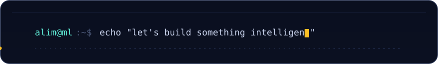

<!-- ╔══════════════════════════════════════════════════════════════╗ -->
<!--                        ANIMATED HEADER                          -->
<!-- ╚══════════════════════════════════════════════════════════════╝ -->

<div align="center">
  
</div>

<!-- ROTATING FOCUS LINE -->
<div align="center">
  <a href="https://github.com/alimkacar">
    
  </a>
</div>

<!-- SOCIALS -->
<div align="center">
  <a href="https://linkedin.com/in/alim-kacar" target="_blank">
    
  </a>
  <a href="https://github.com/alimkacar" target="_blank">
    
  </a>
  <a href="https://huggingface.co/alimkacar" target="_blank">
    
  </a>
  <!-- TODO: replace with your real email -->
  <a href="mailto:alimkacaar@gmail.com">
    
  </a>
  <br/>
  
</div>

<br/>

<!-- ╔══════════════════════════════════════════════════════════════╗ -->
<!--                           ABOUT ME                              -->
<!-- ╚══════════════════════════════════════════════════════════════╝ -->

## `~/` whoami

I build **AI systems end-to-end** — from data pipelines and LLM fine-tuning to production RAG services and the full-stack apps around them. Final-year Computer Engineering student, **Python-first**, and happiest when a research-y idea turns into something that actually ships.

```python
class AlimKacar:
    role      = "AI / Machine Learning Engineer"
    focus     = ["LLM fine-tuning (QLoRA)", "RAG architectures", "Computer Vision"]
    stack     = {"depth": "AI / ML", "breadth": "FastAPI · Next.js · TypeScript"}
    shipped   = ["mAP@0.5 = 0.98 object detector",
                 "hybrid-retrieval RAG chatbot",
                 "Turkish STEM dataset on 🤗 Hugging Face"]
    learning  = ["CS50 AI", "production backend: FastAPI → Postgres → Docker"]
    ask_me    = "RAG · fine-tuning · getting ML into real products"
```

<br/>

<!-- ╔══════════════════════════════════════════════════════════════╗ -->
<!--                     CONTRIBUTION SNAKE                           -->
<!-- ╚══════════════════════════════════════════════════════════════╝ -->

<div align="center">
  
</div>

<br/>

<!-- ╔══════════════════════════════════════════════════════════════╗ -->
<!--                          TECH STACK                             -->
<!-- ╚══════════════════════════════════════════════════════════════╝ -->

## `~/` stack

<table align="center">
  <tr>
    <td align="right"><b>&nbsp;AI / ML&nbsp;</b></td>
    <td>
      <br/>
      
      
      
      
      
      
    </td>
  </tr>
  <tr>
    <td align="right"><b>&nbsp;Web / Backend&nbsp;</b></td>
    <td></td>
  </tr>
  <tr>
    <td align="right"><b>&nbsp;Data / Infra&nbsp;</b></td>
    <td></td>
  </tr>
</table>

<br/>

<!-- ╔══════════════════════════════════════════════════════════════╗ -->
<!--                       FEATURED PROJECTS                         -->
<!-- ╚══════════════════════════════════════════════════════════════╝ -->

## `~/` featured&nbsp;projects

<table>
  <tr>
    <td width="50%" valign="top">
      <!-- TODO: replace href with the Argus repo URL -->
      <h3>🛰️ <a href="https://github.com/alimkacar/argus">Argus — Maritime Object Detection</a></h3>
      <p>Real-time detection of ships & maritime objects with a custom-trained <b>YOLOv8s</b>, tuned to <b>mAP@0.5 = 0.98</b>. Full training + evaluation pipeline.</p>
      
      
      
      
    </td>
    <td width="50%" valign="top">
      <!-- TODO: replace href with the RAG chatbot repo URL -->
      <h3>📄 <a href="https://github.com/alimkacar/pdfchatbpotfinalversion">PDF-Based RAG Chatbot</a></h3>
      <p>Hybrid retrieval (<b>TF-IDF + Sentence-Transformers</b>, RRF) over ChromaDB, local <b>Mistral</b> via Ollama, SSE streaming, and a <b>5-metric evaluation</b> pipeline.</p>
      
      
      
      
    </td>
  </tr>
  <tr>
    <td width="50%" valign="top">
      <!-- TODO: replace href with the Eding Desk repo URL -->
      <h3>🛒 <a href="https://github.com/alimkacar/trendyol-hepsiburada-panel">Eding Desk</a></h3>
      <p>Multi-marketplace customer panel (Trendyol / Hepsiburada) with <b>adapter-pattern</b> architecture, <b>HMAC + AES-256</b> security, and LLM-based intent detection.</p>
      
      
      
      
    </td>
    <td width="50%" valign="top">
      <h3>🧠 <a href="https://huggingface.co/datasets/alimkacar/eding-stem-tr-instruct-1k">Turkish STEM Fine-Tuning</a></h3>
      <p>Self-built Turkish STEM instruction dataset + <b>QLoRA</b> fine-tune of <b>Turkish-Llama-8B</b>. Dataset published on 🤗 Hugging Face.</p>
      
      
      
      
    </td>
  </tr>
</table>

<sub>♟️ <b>Also built:</b> Browser Chess (Stockfish + WebRTC multiplayer) · Turkish sentiment analysis (XGBoost / LightGBM, F1 = 0.809) · WordPress content-security plugin</sub>

<br/><br/>

<!-- ╔══════════════════════════════════════════════════════════════╗ -->
<!--                          GITHUB STATS                           -->
<!-- ╚══════════════════════════════════════════════════════════════╝ -->

## `~/` stats

<div align="center">
  
  
</div>

<div align="center">
  
</div>

<div align="center">
  
</div>

<div align="center">
  
</div>

<br/>

<!-- ╔══════════════════════════════════════════════════════════════╗ -->
<!--                        ANIMATED FOOTER                          -->
<!-- ╚══════════════════════════════════════════════════════════════╝ -->

<div align="center">
  
</div>